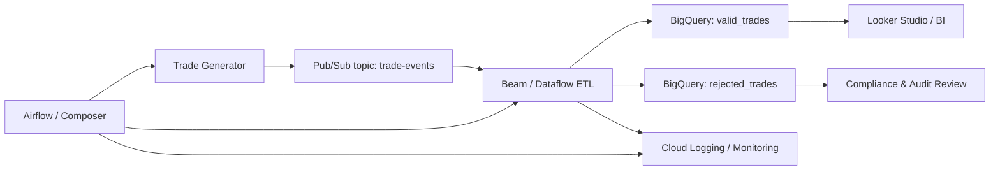

# Architecture

## Logical Flow

## Design Notes

- Pub/Sub decouples producers from downstream consumers and supports real-time ingestion bursts.
- Apache Beam was chosen because it runs locally for development and scales on Google Dataflow in production.
- Valid and rejected trades are stored separately to keep compliance access patterns simple and auditable.
- Airflow orchestrates scheduled generation, batch catch-up runs, health checks, and failure notifications.
- The pipeline can bootstrap from an existing trade snapshot so version-based acceptance is deterministic per run.

## Processing Strategy

The sample implementation uses a batch-friendly reconciliation pattern:

1. Load the current valid trade snapshot from storage.
2. Ingest the new trade events for the run.
3. Group records by `trade_id`.
4. Apply the business rules in version order.
5. Write the final valid state and rejected audit events separately.

In a production deployment, the same rule engine can support a micro-batch or streaming design by periodically reconciling the latest trade snapshot with newly ingested events from Pub/Sub.
